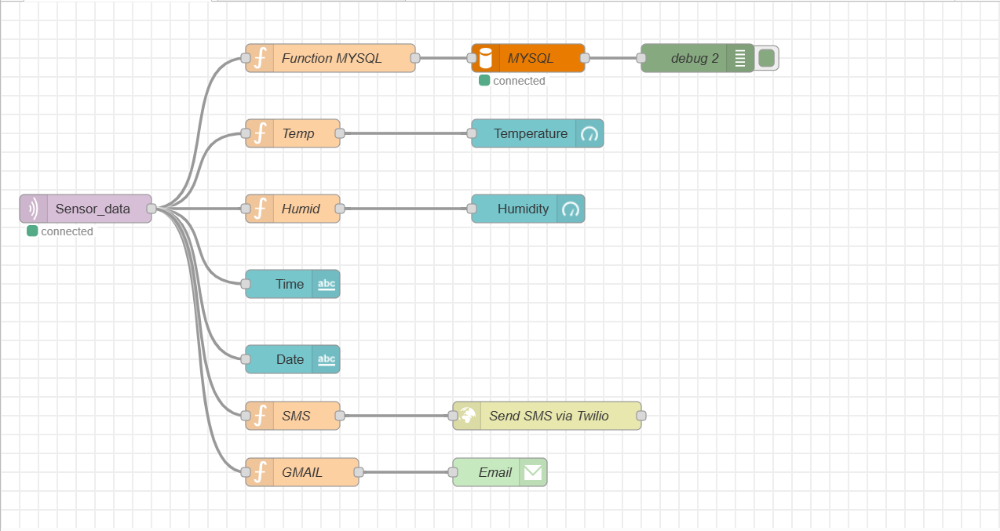
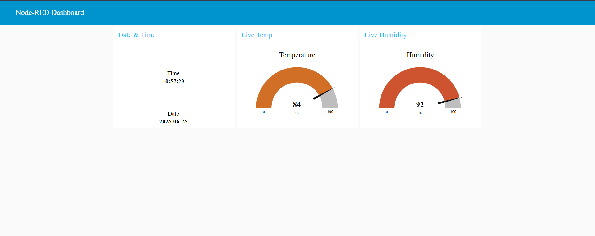
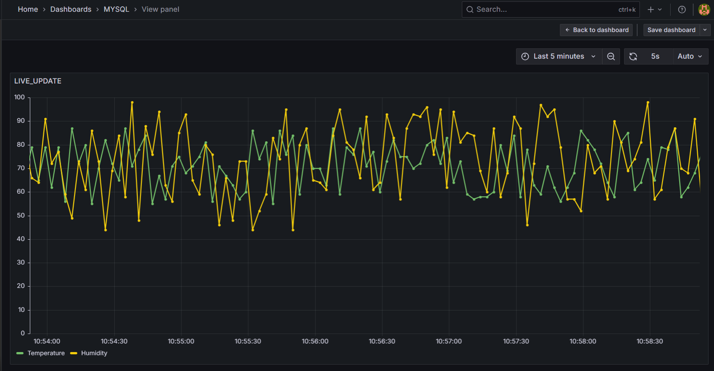
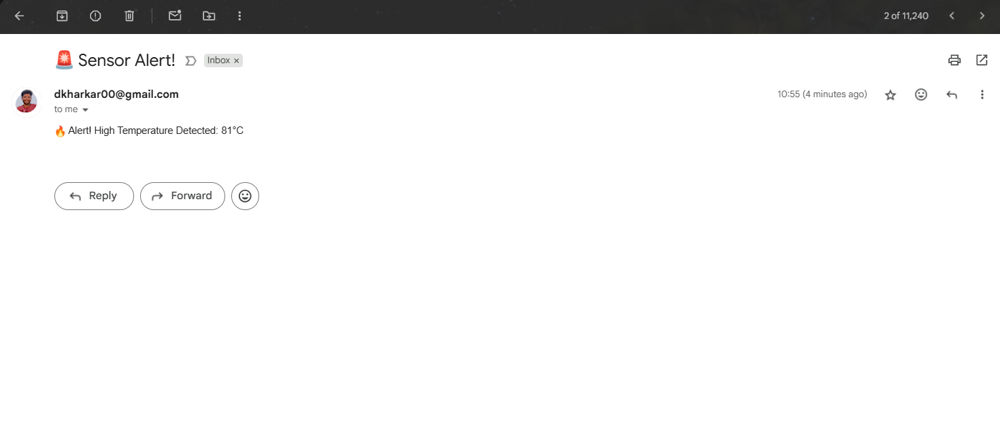
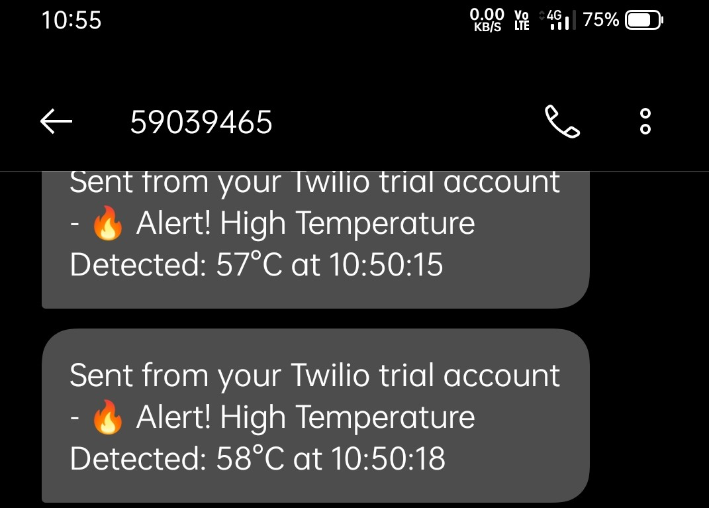

# 🚀 Real-Time IoT Monitoring System using ESP32, MQTT, Node-RED, SQL & Grafana 🌡️📊


## 📌 Project Overview

As part of my **ongoing summer internship at VNIT, Nagpur**, I developed a complete **real-time IoT data monitoring system** using an **ESP32** microcontroller. It simulates **temperature and humidity** readings and delivers them in real-time via the **MQTT protocol**, processes and visualizes them using **Node-RED, SQL Server**, and **Grafana**, and includes a working **Email & SMS Alert System**.

This project demonstrates how embedded systems can be integrated with intelligent backend solutions, offering a robust foundation for real-world Industrial IoT use cases.

> 🔹 **Note:** Simulated random values were used to validate the full-stack workflow without physical sensors. The architecture is modular and ready to integrate DHT11/DHT22 for real-time physical deployment.

---

## 💡 Tech Stack

- **ESP32** – Microcontroller (simulated sensor values)
- **MQTT (Mosquitto Broker)** – Lightweight message transport
- **Node-RED** – Flow design, logic processing, dashboard UI
- **SQL Server** – Centralized structured data storage
- **Grafana** – Real-time and historical data visualization
- **Python** *(Planned)* – For analytics & anomaly detection
- **Email & SMS Alert System** – Notification layer

---

## 🧭 System Architecture

```

ESP32 → MQTT Broker → Node-RED → SQL Server → Grafana
                          ↓
                Email/SMS Alert System

````

---

## 🔍 Key Highlights

✅ Simulated temperature & humidity values (easily swappable with DHT11/DHT22)  
✅ End-to-end real-time data flow: ESP32 → MQTT → Node-RED → SQL Server  
✅ Node-RED Dashboard with **live meter gauges**  
✅ Grafana Dashboard with **trend analysis and visual thresholds**  
✅ Alert system with **real-time Email & SMS notifications**  
✅ Modular, scalable, and cloud-ready pipeline  

---

## 📸 Screenshots

| Screenshot | Description |
|------------|-------------|
| `node_red_flow.png`         | Node-RED flow: MQTT input → SQL → Alerts |
| `node_red_dashboard.png`    | Real-time meter dashboard in Node-RED |
| `grafana_dashboard.png`     | Grafana time-series visualization |
| `email_alert.png`           | Sample alert email screenshot |
| `message_alert.jpg`           | Sample alert message screenshot |

> Screenshots can be found inside the `screenshots/` folder.


---

## ⚙️ Setup Instructions

### 1. ESP32 Setup (Simulation)

```cpp
// Simulate values between 25.0°C–35.0°C and 40%–80%
float temperature = random(250, 350) / 10.0;
float humidity = random(400, 800) / 10.0;
```

* Use the **`PubSubClient`** and **`WiFi`** libraries to connect the ESP32 to Wi-Fi and publish data to the **`Sensor_data`** topic.
* Publish temperature and humidity as comma-separated values (e.g., `28.5,65.0`)
* Full example included in `ESP32_Simulation.ino`

---

### 2. MQTT Broker Setup (Mosquitto)

* Install **Mosquitto MQTT Broker** locally or on a Raspberry Pi/VM.
* Default port: `1883`
* Topic used: `Sensor_data`

You can test publishing/subscribing with tools like **MQTT Explorer** or `mosquitto_sub`.

---

### 3. Node-RED Flow

* Use the `mqtt in` node to subscribe to the topic `Sensor_data`
* Parse the comma-separated payload using a `function` node
* Insert parsed values into **SQL Server** using the `mssql` node
* Add alert conditions using `switch` and `change` nodes
* Use the `email` node or `http request` node to send real-time alerts

> 📂 Flow available in `NodeRED_Flow.json`

---

### 4. SQL Server Table

```sql
CREATE TABLE SensorReadings (
    temp FLOAT,
    humid FLOAT,
    date DATE,
    time TIME
);
```

* Node-RED inserts current timestamp and sensor values into this table.

---

### 5. Grafana Dashboard

* Connect **SQL Server** to Grafana using the **MSSQL data source plugin**
* Create visual panels for:

  * Temperature gauge & trend line
  * Humidity gauge & trend line
  * Alert threshold lines/zones
* Enable real-time updates and historical filtering

---


## 🚨 Alert System

If readings drop below safe thresholds, the system sends notifications:

* 📧 **Email** (via Node-RED's `email` node)
* 📲 **SMS** (via `http request` node using APIs like Twilio)

Example: `temperature < 26°C` or `humidity < 50%`

---
### 🧩 Node-RED Flow


### 📊 Node-RED Live Dashboard


### 📈 Grafana Visualization


### 📬 Email Alert Example


### 📬 Message Alert Example


---
## 🛠️ Future Enhancements

* Replace simulated values with **DHT11/DHT22** sensor
* Push data to **cloud platforms** like AWS, GCP, or ThingsBoard
* Add **Telegram or WhatsApp alert support**
* Use **Python** for anomaly detection / prediction models

---

## 👨‍🔧 Internship Context

This project is part of my **ongoing summer internship at VNIT**, where I’m gaining hands-on experience in embedded systems, automation, and real-time IoT data processing.

### 🔜 What’s Next?

I’m now transitioning into more advanced Industrial IoT systems using the Scientech 6205 IoT Builder Kit. This next phase involves working with:

* ✅ IoT Sensor Nodes
* ✅ Industrial IoT Gateways
* ✅ Real-time data acquisition, automation & visualization pipelines

---

## 📬 Feedback & Collaboration

I’m open to feedback, improvements, and collaboration opportunities.
Feel free to fork, star, raise issues — or connect with me on [LinkedIn](https://www.linkedin.com/in/dhananjaykharkar/)!

---

## 📁 Related Files

* `ESP32_Simulation.ino` – Arduino code to simulate sensor data
* `NodeRED_Flow.json` – Node-RED flow (importable)
* `screenshots/` – Contains UI and alert screenshots

---

⭐ If you found this useful, consider giving the repo a star!

🪪 License
This project is licensed under the MIT License – see the LICENSE file for details.


